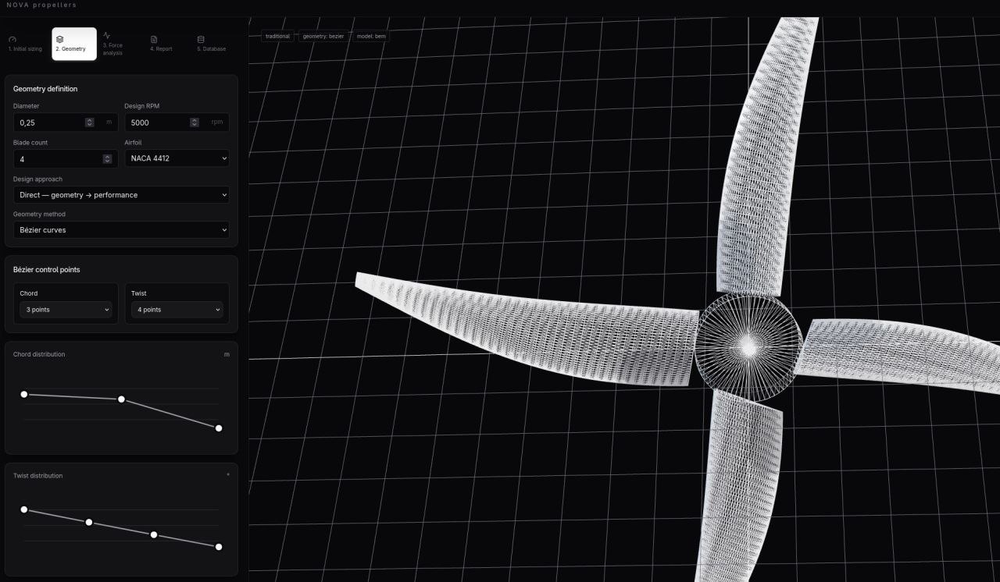

# Nova Propellers

[](https://github.com/mttbrbr/nova-propellers/actions/workflows/ci.yml)
[](LICENSE)
[](CHANGELOG.md)

Nova is an open-source, local-first workbench for designing and exploring
traditional propellers. It brings geometry definition, low-order aerodynamic
analysis, project storage and STL export into one focused interface.



The project grew from a simple propeller configurator into a place where a
design can be followed from its first sizing estimate to a reproducible report.
The aim is not to hide the engineering behind a polished screen: Nova keeps
units, solver maturity, convergence information and warnings visible.

> [!WARNING]
> Nova is alpha software intended for learning, experimentation and research.
> It is not a certified engineering tool. The built-in polar data are synthetic,
> and all results must be independently validated before manufacturing or flight.

## What you can do

- Size a propeller from thrust, power, RPM and operating conditions.
- Build traditional blade geometry with Bézier curves or Laguerre polynomials.
- Inspect the generated propeller in an interactive Three.js viewport.
- Compare BEMT, lifting-line and experimental vortex-based methods.
- Optimize chord and twist distributions against a target thrust.
- Import UIUC/XFOIL-style `.dat` airfoil coordinates and spanwise lofts.
- Store complete projects locally, revisit reports and export STL geometry.

Toroidal propellers are deliberately out of scope for the current alpha. Nova
only exposes methods that match the geometry and analysis paths implemented in
the codebase.

## Quick start

You only need Docker Engine (or Docker Desktop) and Docker Compose v2.

```bash
git clone https://github.com/mttbrbr/nova-propellers.git
cd Nova
docker compose up --build -d
```

Once both containers are healthy, open:

- Nova: <http://localhost:5173>
- interactive API documentation: <http://localhost:8000/docs>
- API health check: <http://localhost:8000/api/health>

Useful day-to-day commands:

```bash
docker compose ps
docker compose logs -f
docker compose down
```

Projects and imported airfoils live in the `nova_backend_data` Docker volume,
so a normal restart or `docker compose down` keeps them. Running
`docker compose down --volumes` removes that local data as well.

If port 5173 or 8000 is already in use, copy `.env.example` to `.env` and
change `NOVA_FRONTEND_PORT` or `NOVA_BACKEND_PORT` before starting the stack.

## Typical workflow

1. Enter the operating point and let Nova estimate an initial diameter.
2. Define chord, twist and airfoil distribution in the geometry workspace.
3. Generate and inspect the mesh, then export it to STL if needed.
4. Run one or more aerodynamic methods and compare their results.
5. Review the report and save the complete project to the local database.

## Method status

| Method | Role | Maturity | Intended use |
| --- | --- | --- | --- |
| Actuator disk | Sizing reference | Ideal reference | Disk area and ideal induced power |
| BEMT | Analysis and optimization | Preliminary | Traditional propeller iteration with synthetic or imported polars |
| LLT | Analysis and optimization | Preliminary | Low-order trend comparison |
| VLM | Analysis and optimization | Experimental | Solver architecture experiments |
| BEM | Analysis and optimization | Experimental | Solver architecture experiments |

The deterministic benchmark checks software consistency and expected trends;
it is not experimental validation. The assumptions and provenance of each
method are documented in [docs/ALGORITHMS.md](docs/ALGORITHMS.md).

## Development

The base Compose file builds self-contained local images. Add the development
override for source mounts and automatic reload:

```bash
docker compose -f docker-compose.yml -f docker-compose.dev.yml up --build
```

Run the same checks used by CI:

```bash
# Backend
docker compose run --rm --no-deps backend python -m unittest discover -s tests -v
docker compose run --rm --no-deps backend python -m inverse_design.benchmark

# Frontend
docker compose run --rm --no-deps frontend npm run lint
docker compose run --rm --no-deps frontend npm run build

# Source and dependency policy
python tools/check_licenses.py
python tools/check_source_archive.py
```

## Architecture

```text
frontend/            React, Vite and Three.js interface
backend/             FastAPI application and SQLite persistence
  inverse_design/    Geometry, solvers, optimizer and benchmark
  airfoil_management/ Coordinate import, normalization and lofting
docs/                Algorithm notes and project media
tools/               Release and license checks
```

The frontend sends `/api` requests through Vite's local proxy. FastAPI owns the
canonical geometry used by analysis, persistence and export, while SQLite keeps
projects, airfoils and polar sets on the local machine.

## Project status

The next source release is `v0.1.0-alpha.2`. Work towards a trustworthy
engineering workflow is tracked in the [roadmap](ROADMAP.md), and user-visible
changes are recorded in the [changelog](CHANGELOG.md).

Issues and focused pull requests are welcome. Please read
[CONTRIBUTING.md](CONTRIBUTING.md) before contributing and use the private
reporting route described in [SECURITY.md](SECURITY.md) for vulnerabilities.

Nova is available under the [Apache License 2.0](LICENSE). Dependency licenses
and source/media provenance are recorded in
[THIRD_PARTY_NOTICES.md](THIRD_PARTY_NOTICES.md) and
[PROVENANCE.md](PROVENANCE.md).
